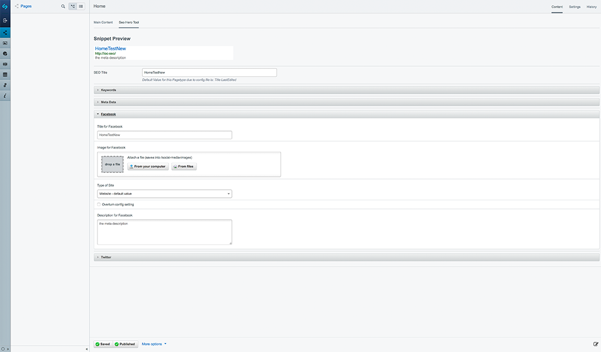
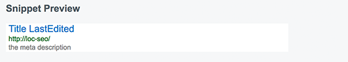
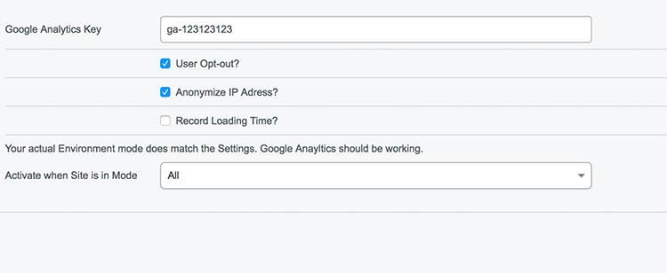
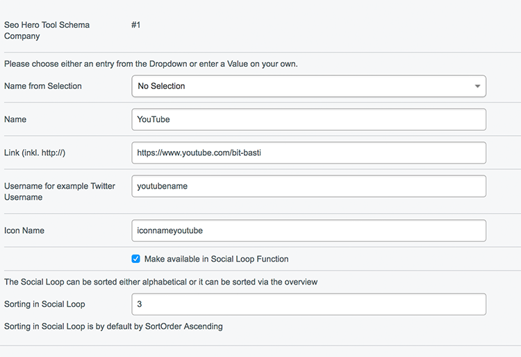

# SeoHeroTool

[](https://travis-ci.org/nomidi/silverstripe-seo-hero-tool)

The SeoHeroTool offers options to control the Meta Information of a Website. The SeoHeroTool offers on the hand to change settings on a per page basis (like the MetaTitle, OpenGraph- or Twitterinformation) and to enter general information (like Google Analytics, links to Facebook, Twitter or for example to enter Redirects).
While the page settings are entered on each page, the general settings can be accessed via the SeoHeroTool-Icon.

As many Pages of the same type (for example all DummyPages) have the same MetaTitle structure in common it is possible to define for those the structure via the `config.yml` file.

## Requirements

- SilverStripe CMS ~3.5

## Installation

```sh
composer require nomidi/silverstripe-seo-hero-tool
```
Alternatively simply download the zip file from github.
After installation run a run `dev/build`

## Seo Hero Tool

Once the SeoHeroTool is installed each page has a tab called *SeoHeroTool* will appear.



The SeoHeroTool-Tab offers the following information:
- Snippet Preview
- SEO Title
- Keywords
- Meta Data
- Facebook
- Twitter

### Snippet Preview

The Snippet Preview is a preview on how this webpage will appear in a search result. If you update any site information it is necessary to save the site to get an updated Preview.



### SEO Title

The SEO Title is the part which appears in the *<head>* of each website within the *<title>*-tag. By default this is the *Title* of the Website.


It is possible to define the SEO Title via the *config.yml*-file. This is explained in the part *Creating default settings in the configuration* later in this document.
But it is also possible to set the SEO Title manually.
The order of appearance if the following:
- default Title
- Title from configuration
- Title entered via the SeoHeroTool

The SEO Title which is actually used is entered as placeholder. If this Page Type has a Title configuration then the Title from the configuration will be displayed below the SEO Title.
[Configuring the title in the config](#define-title-for-page-types)

### Keywords

The Keywords section is just used in the Pro Version of the SeoHeroTools.

### Meta Data

Meta Data contains information regarding Meta Informations:
- Index
- Canonincal URL
- MetaDescription
- Google Schema Org Data


The MetaDescription is by default the first 140 Characters from the Content. From that everything until the last space will be removed so that no incomplete word will be shown.
The Meta Description can be overwritten.

If there is any Schema Data for this page type defined this will be displayed under Google Schema Org Data.
The preview will also show any errors in case that a field can not be resolved (for example missing field).


### Facebook

Under Facebook you will find all information regarding the sharing of this site on Facebook. This information will be parsed in the OpenGraph Format on the Website.


The Facebook Title is by default the same as the *SEO Title*.
The MetaDescription is by default the MetaDescription.
The Type of Site is by default `website`. This can be configured via the `SeoHeroToolDataObject`.
If the Type of Site is set via the configuration it can be overwritten for a specific page. In order to so please select a different Type and check the box *overturn config setting*.

### Twitter

Under Twitter you will find all information regarding the sharing of this site on Twitter. This information will be parsed in Twitters own format.


The Twitter Title is by default the same as the *SEO Title*.
The MetaDescription is by default the MetaDescription.

## Creating default settings in the configuration
### Define Title for Page Types

This defination takes place in the `mysite/_config/config.yml'.

``` yml
SeoHeroToolDataObject:
  Page:
    Title:
      - $Title # reads the field Title
      - $LastEdited # reads the date from the field LastEdited
    WithoutSpace: false # defines that all entries above are separated by a space
  TestPage:
    Title:
      - $Title # reads the field Title
      - " at " # just the string " at "
      - $LastEdited # the date from the field LastEdited
      - $MyTest() # the value of the method MyTest within the class TestPage
      - $TestObject.Title # The title of the Has_One Connection with TestObject
    DateFormat: SpecialFormat # Each Datefield shall be formated in a special format
    DateFormatting: d/m # each datefield will be output just by date and month (you can use here the normal php date values)
    WithoutSpace: true # no space between entries
    SiteConfigTitle: true # the title from the SiteConfig will be attached ( default false)
    FBType: article # The og:type for this site will be article (default website)
```

This configuration will result in the following:
All Pages with the Type of Page will have a MetaTitle which consist of the `Title`of the Page followed by a blank followed by the date of the `lastEdit` of the Page. If the title of this page is `Home` and the date of the last edit is `2017-04-30 10:13:12` this will result in the MetaTitle `Home 30/04/2017`. By default all datefields will be output by the Silverstripe `date()`-function.

All Pages with the Type of TestPage will have a more complex MetaTitle. These Pages have no blank character between each entry.
`$Title` works as in the example above. `" at "` adds just these characters directly after the value of `$Title`.
`$MyTest` runs the method MyTest in the class TestPage. Keep in mind that this method needs a return value.
`$TestObject.Title` returns the `Title`from the has_one connection with `TestObject`.
`DateFormat` can have the following values: Nice, Year, Nice24 and SpecialFormat. Except SpecialFormat the other values uses the default Silverstripe functions to format the date.
If the DateFormat is SpecialFormat, then the field DateFormatting will be used. Here the configuration which would be used for the Silverstripe Date Format method is allowed. d/m will result in the day followed by the month.
`WithoutSpace: true` defines that no blank will be entered between each entry.
`SiteConfigTitle: true` defines that the Title from the SiteConfig will be added at the end.
`FBType: artice` defines, that all sites of the type TestPage will have as og:type the value of `article`. The default value here is `website`.

#### Important to know
 - It is not possible to define has-many or many-many connections directly. To do so please create a method in your class which returns the wanted value and use then the method via `$myMethodName()`.
 - When a page type is configured via the `config.yml` it can be overwritten in the backend. Information in the backend always overwrites the configuration setting.
 - When you do a change to the `config.yml` remember to do a `dev/build?flush=1` afterwards to apply the new settings.

### Define schema data for Page Types

With the SeoHeroTool it is possible to define for page types a json schema which will always be part of the website.
This defination takes place in the `mysite/_config/config.yml'.

```yml
SeoHeroToolSchemaDataObject:
  LocationPage:
    @type: "Test"
    address:
      @type: "PostalAddress"
      addressLocality: $DummyObject.Title
      postalCode: "12345"
      streetAddress: $getStreet()
    name: $Title
    telephone: "XXX XXX"
    email: "mail@example.com"
```
The above configuration will result in the following output.
``` json
<script type="application/ld+json">
 {
   "@type": "Test",
   "address": {
       "@type": "PostalAddress",
       "addressLocality": "London",
       "postalCode": "12345",
       "streetAddress": "John Doe Avenue 1"
   },
   "name": "Dummy Page Title",
   "telephone": "01234 23234234",
   "email": "mail@exampl.com"
}
 </script>
```

The Configuration of the SeoHeroToolSchemaDataObject is quite similar to the configuration of the SeoHeroToolDataObject.
You can use normal strings by entering them simply. To use variables of a class just enter them with a starting *$*.
A Has-One connection can be represented by a starting *$* followed by the name of the Has-One connection. Add then the Variabe separated by a dot.
Methods of the class can be accessed a starting *$* and an ending *()*. To access the public Method *getStreet()* from the class LocationPage simply enter `$getStreet()`.

#### Important to know
 - It is not possible to define has-many, many-many and similar relationships directly. For this please write a method which returns the correct value.
 - The output of the json configuration of this website can be viewed in the backend. Simply on a page which has a configuration switch to the SeoHeroTool-tab and open the MetaData.
 - If there is *any* error in the configuration you will also see this in the backend.
 - After a change in the `config.yml` please do not forget to run a `dev/build?flush=1`.

# General settings

Under General Settings the following options can be configured:
- Google Analytics
- Schema.org Company
- Robots and .htaccess Editor

## Google Analytics

Google Analytics allows an easy integration of Google Analytics into the website.



*Activate when Site is in Mode* defines in which environment mode Google Analytics should be active. The possible values are *dev*, *live*, *test*, *All*. *All* covers all environment modes.
Directly above the field you will see if the current environment mode matches the choosen selection. Keep in mind that this setting just updates after you hit save.

## Schema Org Company

Schema Org Company allows to enter directly in the backend some information about the company. This information is meant mainly for search engines and will be used by them.
It is also possible in the Tab *Opening Hours* to define the Opening Hours. This is especially useful for buisnesses which have stores like restaurants or shops.
In the last Tab *Social Links* information about the used Social Networks can be entered (see Social Media channels).
This information will be used in the Schema Org JSON Object but will also be used for example in the Social Loop.

### Social Media channels



Each Social Link contains of the following Information:
- Name
- Link
- Username
- Iconname
- Display in Social Loop
- Sorting

The *Name* can either be choosen from the selection or entered manually if the Network is not in the list.
The *Link* should be the complete http-Link.
*Username* is necessary for example for Twitter as this will also be displayed in the Twitter Meta Data.
*Iconname* is useful if in the Social Loop there should be the possiblity to add this as classname.
*Make available in Social Loop Function* defines if this Network will be displayed in the `$SocialLoop` Function.
*Sorting in Social Loop* defines the position in the Social Loop. See for more on this *Social Media Loop*.

#### Social Media Loop

If you want to loop all Social Media Channels which are entered and have the option do be displayed in a loop this can be achieved by looping `$SocialLoop`. By default it will return the Social Media Channel in order of their *Sort*-value ascending. But this can easily be changed with the Silverstripe methods. To loop the Social Media Channel in ascending Order by Name simply do the following loop:
```
<% loop $SocialLoop(Name,ASC) %>
$Title<br/>
<% end_loop %>
```
This will display all Social Media Channel-Titles with the option *Make available in Social Loop Function* in ascending order sorted by the Name.

## Robots and .htaccess Editor

The Robots and .htaccess Editor allows right now just the insertion of 301-Redirect Links. New 301-Redirects will be tested for reasonabless but keep in mind that it is possible to break the website with this tool. So just experienced Users should use this.

# Todo

- add own icon for SeoHeroTool Settings
- Beautify General Settings structure so that it needs less clicks
- add more functionality to the Robots and .htaccess Editor
- add configuration setting to enable/disable Robots and .htaccess Editor
