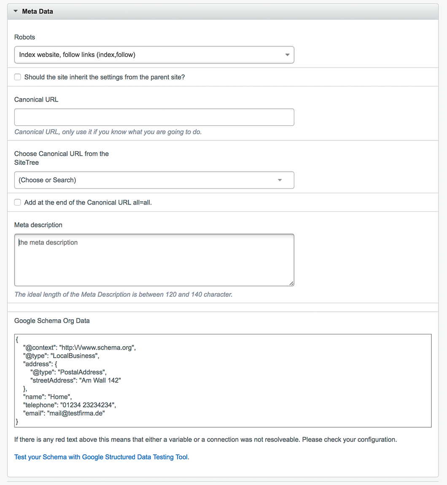
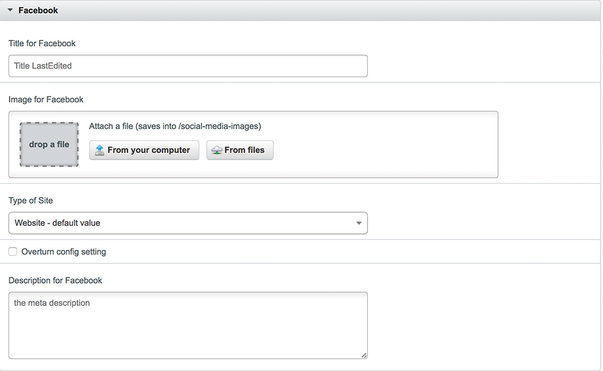
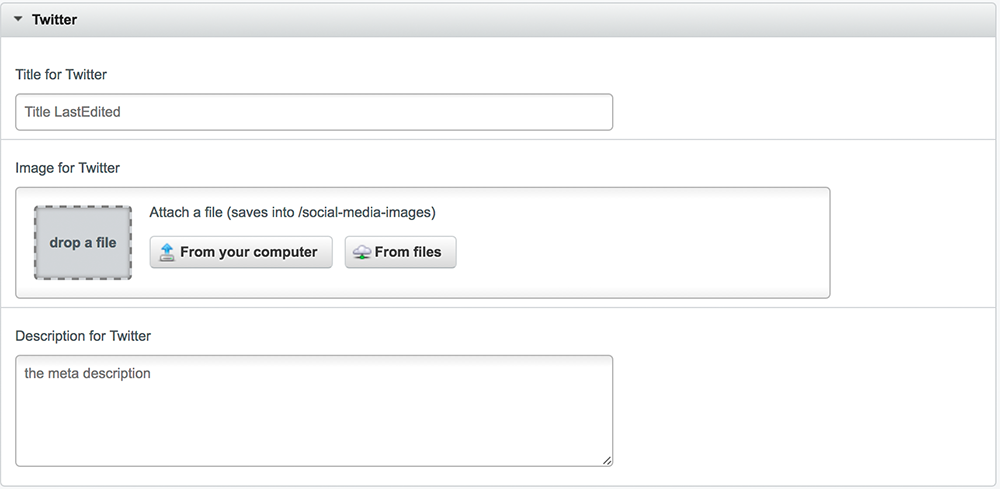

# SeoHeroTool

[](https://travis-ci.org/nomidi/silverstripe-seo-hero-tool)

The SeoHeroTool offers options to control the Meta Information of a Website. The SeoHeroTool offers on the hand to change settings on a per page basis (like the MetaTitle, OpenGraph- or Twitterinformation) and to enter general information (like Google Analytics, links to Facebook, Twitter or for example to enter Redirects).
While the page settings are entered on each page, the general settings can be accessed via the SeoHeroTool-Icon.

As many Pages of the same type (for example all DummyPages) have the same MetaTitle structure in common it is possible to define for those the structure via the `config.yml` file.

## Requirements

- SilverStripe CMS ~3.5

## Installation

```sh
composer require nomidi/silverstripe-seo-hero-tool
```
Alternatively simply download the zip file from github.
After installation run a run `dev/build`

## Seo Hero Tool on a page

Once the SeoHeroTool is installed on each page a new tab called *SeoHeroTool* will appear.


The SeoHeroTool-Tab offers the following information:
- Snippet Preview
- SEO Title
- Keywords
- Meta Data
- Facebook
- Twitter

### Snippet Preview

The Snippet Preview is a preview on how this webpage will appear in a search result. If you update any site information it is necessary to save the site to get an updated Preview.

### SEO Title

The SEO Title is the part which appears in the *<head>* of each website within the *<title>*-tag. By default this is the *Title* of the Website.
It is possible to define the SEO Title via the *config.yml*-file. This is explained in the part *Creating default settings in the configuration* later in this document.
But it is also possible to set the SEO Title manually.
The order of appearance if the following:
- default Title
- Title from configuration
- Title entered via the SeoHeroTool

The SEO Title which is actually used is entered as placeholder. If this Page Type has a Title configuration then the Title from the configuration will be displayed below the SEO Title.

### Keywords

The Keywords section is just used in the Pro Version of the SeoHeroTools.

### Meta Data

Meta Data contains information regarding Meta Informations:
- Index
- Canonincal URL
- MetaDescription
- Google Schema Org Data



The MetaDescription is by default the first 140 Characters from the Content. From that everything until the last space will be removed so that no incomplete word will be shown.
The Meta Description can be overwritten.

If there is any Schema Data for this page type defined this will be displayed under Google Schema Org Data.
The preview will also show any errors in case that a field can not be resolved (for example missing field).


### Facebook

Under Facebook you will find all information regarding the sharing of this site on Facebook. This information will be parsed in the OpenGraph Format on the Website.


The Facebook Title is by default the same as the *SEO Title*.
The MetaDescription is by default the MetaDescription.
The Type of Site is by default `website`. This can be configured via the `SeoHeroToolDataObject`.
If the Type of Site is set via the configuration it can be overwritten for a specific page. In order to so please select a different Type and check the box *overturn config setting*.

### Twitter

Under Twitter you will find all information regarding the sharing of this site on Twitter. This information will be parsed in Twitters own format.



The Twitter Title is by default the same as the *SEO Title*.
The MetaDescription is by default the MetaDescription.

## Creating default settings in the configuration
### 1. Define Title for Page Types in `mysite/_config/config.yml`

``` yml
SeoHeroToolDataObject:
  Page:
    Title:
      - $Title # reads the field Title
      - $LastEdited # reads the date from the field LastEdited
    WithoutSpace: false # defines that all entries above are separated by a space
  TestPage:
    Title:
      - $Title # reads the field Title
      - " at " # just the string " at "
      - $LastEdited # the date from the field LastEdited
      - $MyTest() # the value of the method MyTest within the class TestPage
      - $TestObject.Title # The title of the Has_One Connection with TestObject
    DateFormat: SpecialFormat # Each Datefield shall be formated in a special format
    DateFormatting: d/m # each datefield will be output just by date and month (you can use here the normal php date values)
    WithoutSpace: true # no space between entries
    SiteConfigTitle: true # the title from the SiteConfig will be attached ( default false)
    FBType: article # The og:type for this site will be article (default website)
```

This configuration will result in the following:
All Pages with the Type of Page will have a MetaTitle which consist of the `Title`of the Page followed by a blank followed by the date of the `lastEdit` of the Page. If the title of this page is `Home` and the date of the last edit is `2017-04-30 10:13:12` this will result in the MetaTitle `Home 30/04/2017`. By default all datefields will be output by the Silverstripe `date()`-function.

All Pages with the Type of TestPage will have a more complex MetaTitle. These Pages have no blank character between each entry.
`$Title` works as in the example above. `" at "` adds just these characters directly after the value of `$Title`.
`$MyTest` runs the method MyTest in the class TestPage. Keep in mind that this method needs a return value.
`$TestObject.Title` returns the `Title`from the has_one connection with `TestObject`.
`DateFormat` can have the following values: Nice, Year, Nice24 and SpecialFormat. Except SpecialFormat the other values uses the default Silverstripe functions to format the date.
If the DateFormat is SpecialFormat, then the field DateFormatting will be used. Here the configuration which would be used for the Silverstripe Date Format method is allowed. d/m will result in the day followed by the month.
`WithoutSpace: true` defines that no blank will be entered between each entry.
`SiteConfigTitle: true` defines that the Title from the SiteConfig will be added at the end.
`FBType: artice` defines, that all sites of the type TestPage will have as og:type the value of `article`. The default value here is `website`.

#### Important to know
 - It is not possible to define has-many or many-many connections directly. To do so please create a method in your class which returns the wanted value and use then the method via `$myMethodName()`.
 - When a page type is configured via the `config.yml` it can be overwritten in the backend. Information in the backend always overwrites the configuration setting.
 - When you do a change to the `config.yml` remember to do a `dev/build?flush=1` afterwards to apply the new settings.

### 2. Define schema data for Page Types in `mysite/_config/config.yml`

With the SeoHeroTool it is possible to define for page types a json schema which will always be part of the website.

```yml
SeoHeroToolSchemaDataObject:
  LocationPage:
    @type: "Test"
    address:
      @type: "PostalAddress"
      addressLocality: $DummyObject.Title
      postalCode: "12345"
      streetAddress: $getStreet()
    name: $Title
    telephone: "XXX XXX"
    email: "mail@example.com"
```
The above configuration will result in the following output.
``` json
<script type="application/ld+json">
 {
   "@type": "Test",
   "address": {
       "@type": "PostalAddress",
       "addressLocality": "London",
       "postalCode": "12345",
       "streetAddress": "John Doe Avenue 1"
   },
   "name": "Dummy Page Title",
   "telephone": "01234 23234234",
   "email": "mail@exampl.com"
}
 </script>
```

The Configuration of the SeoHeroToolSchemaDataObject is quite similar to the configuration of the SeoHeroToolDataObject.
You can use normal strings by entering them simply. To use variables of a class just enter them with a starting *$*.
A Has-One connection can be represented by a starting *$* followed by the name of the Has-One connection. Add then the Variabe separated by a dot.
Methods of the class can be accessed a starting *$* and an ending *()*. To access the public Method *getStreet()* from the class LocationPage simply enter `$getStreet()`.

#### Important to know
 - It is not possible to define has-many, many-many and similar relationships directly. For this please write a method which returns the correct value.
 - The output of the json configuration of this website can be viewed in the backend. Simply on a page which has a configuration switch to the SeoHeroTool-tab and open the MetaData.
 - If there is *any* error in the configuration you will also see this in the backend.
 - After a change in the `config.yml` please do not forget to run a `dev/build?flush=1`.

# General settings


## OLD

-- OLD INFORMATION --
## Overview
 - GoogleAnalytics
 - Schema.org
 - Social Media
 - SeoHeroTool Tab
 - Keywords and Meta
 - Robots and .htaccess Editor

## Google Analytics

Add
```
SeoHeroTool:
  google_key: 'UA-xxx'
  environment_type: 'dev'
  member_status: true
  anonymizeIP: false
  loadTime: false
  userOptOut: false
```
to your config.yml. Replace UA-xxx with your Google Analytics Universal ID.
Environment type can be either 'dev','test','live' or 'all'.
Member status checks if logged in Members are also counted. true counts them,
false not.
anonymizeIP defines if the IP Address will be transmitted anonymized, which is
the default setting.

## Schema.org

Data entered here will be used to create a correct schema file which is useful for search engines.

Furthermore it is possible via the .yml configuration to create own schemas. In those schemas it is possible
to access variables of the page and to access variables of has_one connections.

The below example shows all possibilities which can be used within the .yml creation.
The normal fields should be pretty self-explanatory. Just keep in mind that the first part should match
exactly the definition on schema.org.
name, streetAddress and addressLocality are the interesting parts.

name has $Title. This means that after processing there will be displayed the Title-Varibale from the DummyPage.
streetAddress has the value of the method getStreet() which must be either part of the class or any parent-class. This way it is possible to create return values of basically any kind.
$DummyOBject.Title means, that DummyPage has a has_one connection with DummyObject. And from this dataobject the Title will be used.

If any of the variable/connections/methods returns nothing or an empty value the whole json object will not be created.

```
SeoHeroToolSchemaDataObject:
  DummyPage:
    @context: "http://www.schema.org"
    @type: "LocalBusiness"
    address:
      @type: "PostalAddress"
      addressLocality: $DummyObject.Title
      postalCode: "12345"
      streetAddress: $getStreet()
    name: $Title
    telephone: "01234 23234234"
    email: "mail@testfirma.de"
```

This will create when the page is rendered the following json in the schema.org format. It is important that if you are
willing to use this feature you ensure that you know about the correct structure of the schema you want to represent.

```
<script type="application/ld+json">
 {
   "@context": "http:\/\/www.schema.org",
   "@type": "LocalBusiness",
   "address": {
       "@type": "PostalAddress",
       "addressLocality": "Dummy Object Title",
       "postalCode": "12345",
       "streetAddress": "Am Bruch 1"
   },
   "name": "Dummy Page Title",
   "telephone": "01234 23234234",
   "email": "mail@testfirma.de"
}
 </script>
```
## SocialMedia

SocialMedia sites can be entered and for examples looped later on the website. This is useful to have all important social media data in one place.

To output the Social Media Loop simply loop the function $SocialLoop.
By default the loop will be sorted by the sorting which can be changed in the backend. But it is possible to sort it alphabetical with the default
Silverstripe functions which would look like this $SocialLoop.Sort(Name,ASC)

## SeoHeroTool Tab

Once the SeoHeroTool is installed you will see on all pages a tab called SeoHeroTool. Within this tab you can configure the following:

- SEO Title Tag
- Keywords (used in SeoHeroTool Pro)
- MetaData
- Facebook
- Twitter

Furthermore the SeoHeroTool Tab gives you a preview on how your website will appear in a search result.

### SEO Title Tag

The SEO Title defines the value for the Title attribute. By default this is the title of this site.
It is possible via the SeoHeroToolDataObject to define a title based on data fields. This is explained in detail in the chapter
Generating of the MetaDataTitle and FB Type.

### Keywords

The Keywords are not used in the SeoHeroTool right now. At the moment they are used in the SeoHeroTool Pro in the keyword analysis and general webpage analysis.

### MetaData

Metadata contains all necessary MetaData Information. This includes the following:
- information for search robots
- possiblity to add a canonical URL
- Meta Description
- langhref attribute if this is a multilingual page.
- Google Schema Org Data if defined in SeoHeroToolSchemaDataObject

### Facebook

For a better sharing experience it is possible to enter data for Facebook Sharing.
This includes the Title for the page, an Image for Facebook which will be shown if this page gets shared, the Type of this Site and a Description for Facebook.
As Default value for Title and Description the SEO Title and Meta Description will be used.
The default Type for the site will be Website. This can be also configured via the SeoHeroToolDataObject.
In case that a specific page shall have a different Type it is possible to overturn the one from the configuration via a checkbox.  

### Twitter

For a better sharing experience it is possible to enter data for Twitter Sharing.
This includes the Title for the page, an Image for Twitter and a Description.
As Default value for Title and Description the SEO Title and Meta Description will be used.

## Keywords and Metadata

### Generating of the MetaDataTitle and FB Type

With an installed SeoHeroTool the Title for the page which appear in within the <title>-Tag will always be generated with the Method MetaTitle().
Therefore the Variable $Title is not necessary anymore within the <title>-Tag and can be removed. But this is not necessary.

It is possible to generate the MetaTitle for a website via the config.yml file.
To do so please add the following:
```
SeoHeroToolDataObject:
  Page:
    Title:
      - $Title
      - $LastEdited
    WithoutSpace: false
  TestPage:
    Title:
      - $Title
      - " at "
      - $LastEdited
      - $MyTest()
      - $TestObject.Title
    DateFormat: SpecialFormat
    DateFormatting: d/m
    WithoutSpace: true
    SiteConfigTitle: true
    FBType: article
```

All Pages with the Type Page will be displayed in the title in this case with
the Title and the Date of the last Edit. Between both there will be a space.
All Pages with the Type TestPage will have the field Title, followed by an "at", followed by the time of the last edit of the page, followed by the return of the function MyTest() and lastly the Title of the has-one connection TestObject. There will be no spacing character between each entry. The Pages with the Type of TestPage will also have the SiteConfigTitle at the end.

Options for DateFormat are : Nice24, Year, Nice and SpecialFormat.
If SpecialFormat is set, then the setting DateFormatting determines how the
date will be formatted. In this example just the day and month of the date will be
displayed.

The option FBType defines the og:type attribute of the page type. The og:type is part of the OpenGraph Protocol.
By default each page is a 'website', but it can also be for example an 'article', which is usefuel for Blogs or News Posts or it can be a 'product'. If a specific page should have a different Type than all other pages with the same page type it is possible to overturn the configuration FBType in the SeoHeroTool for this specific page.

Please keep in mind, that in the default theme the Sitename will always be attached to the pagename at the end of the title.
If you want to use the SiteConfigTitle option with the SeoHeroToolDataObject the Sitename will appear twice. Please check your
theme and remove the Sitename in the <title>-tag if you want to control it via SeoHeroTools.

## Robots and .htaccess Editor

At the moment it is just possible in this section to create 301 Redirects. Those redirects can be used to
forward old pages which are not exisiting anymore to a new page. The browser will then receive 404 error message but
will be forwarded to the new page.
